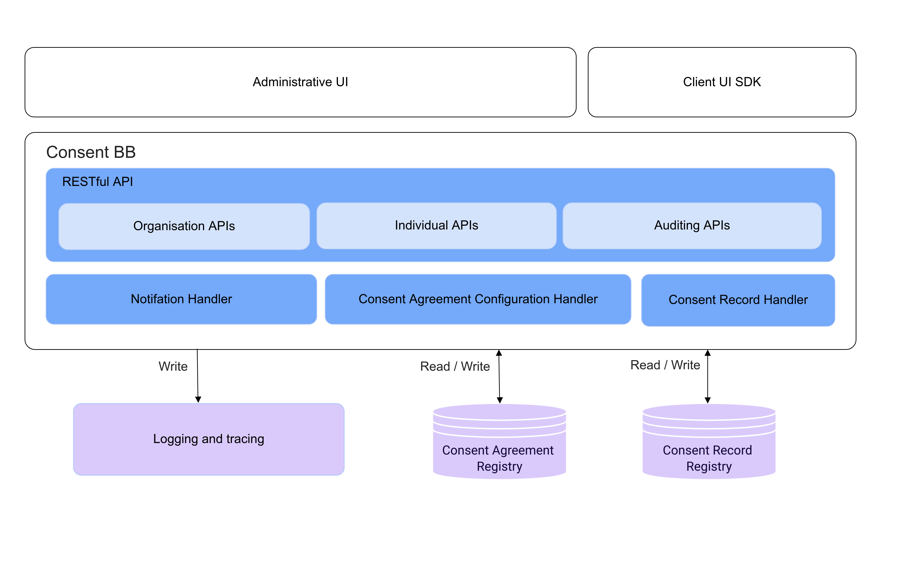
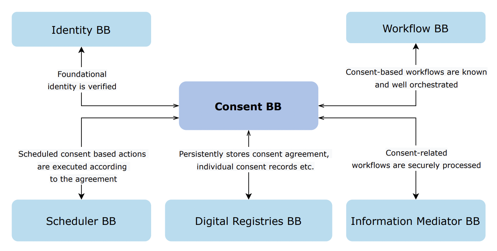

# 4 Key Digital Functionalities

Consent BB enables the organisations to enforce Data Policies that require signed consent by Individuals for the use of their personal data. Its key purpose is to allow individuals to view Consent Agreements and sign or withdraw their consent on what personal data is used and accessible to organisations. It also clarifies the Data Policy applied, such as the purpose, retention period, jurisdiction, third-party data sharing, etc.

The Consent BB implements the key functionalities described in the [consent management lifecycle](./2-description.md#23-consent-agreement-lifecycle). It includes the ability to configure consent agreement by an organisation admin, present consent requests towards individuals, capture consents, enable queries if consent exists or not, and enable independent audit of consents. 
## 4.1 Assumptions

This lays out the pre-conditions needed for anyone to use Consent BB.

1. Data Disclosure Agreements between organisations are already in place. For e.g. a healthcare organisation has already got the required authorisation to use the citizen data registry.
2. To link a Consent Agreement with the specific Individual, Consent BB assumes the authentication & authorization to be handled in a trusted manner outside of it (see below).
3. Within the early scope of the Consent BB, the act of delegating is kept outside the scope of Consent BB. It is assumed that the authorisation to act on behalf of someone else is already resolved.
4. It is the organisation's (a Data Provider or a Data Consumer) obligation to manage and implement internal policies towards its employees relating to their individual responsibilities for Personal data processing integrity, specifying it in the employment contract or by other means.
## 4.2	Out-of-scope and Future Considerations

The following use cases are out of scope for this version 1.0 of Consent BB. These may be considered as potential future enhancements.

1. Non-reusable/single-action consent given in physical settings.
2. Consent to use data other than personal information on behalf of an organisation. For example, an organisation authorising an individual to consent to expose some organisation’s data is seen out of the scope of the consent building block.
3. Consent delegation: While being part of the Consent BB, this will be taken up in the future. For e.g. an individual is authorising another individual to consent on their behalf.
4. “Multi-Consent” is when consent **can** be given by more than one person or when consent is **required** to be given by more than one person. An example is given by the registration of a child whose consent is actually given by a parent or both in certain use cases. 

    In the current version of the specification, muti-consent can be implemented at the business process level, with multiple calls to the Consent BB. One call per consent transaction. In the future, it is planned to extend the functionalities of the BB to provide support for multi-consent.

5. Relationships between multiple Agreements will allow for a single transaction to capture an individual’s signature on multiple Agreements.

6. Consider individual rights (E.g. as per GDPR / Data Protection Act etc.), potentially amending Scenarios 4.x, API endpoints functionality and the capture of Consent Records.

   * The right to be informed
   * The right of access
   * The right to rectification
   * The right to erasure
   * The right to restrict processing
   * The right to data portability
   * The right to object
   * Rights about automated decision-making and profiling.

7. The elaborated lifecycle for Consent Agreement amendments: Data Policies and Consent Agreements may change over time. Such events are sensitive to existing Consent Records.

   * Notifications for any consent agreement changes; Individuals and Data Consuming and Data Providing Systems.
   * Notifications of Consent Record changes in bulk and separate: Data Consuming and Data Processing Systems.
   * All lifecycle events of Consent Agreements and Consent Records are mapped as Audit Event Types, and the external auditing system is notified.

8. Roles and scopes for IAM (Identity Management)  and RBAC to be used within consent BB

9.  We need to enable audit logging capabilities aligned with the overall GovStack goals. Issues to be addressed include audit log access control, the type of information captured in the audit log, and taking care of sensitive data or meaningful metadata.
10. Certain update use cases (e.g. modify consent agreement) might result in invalidating a previously acquired individual consent.  This will be investigated for future releases. 

## 4.3	Consent BB Components

Within **the scope of Consent BB version 1.0,** the required components are as given:

[Diagram Source](https://app.moqups.com/P01asyy7ba/view/page/ad64222d5)

**Consent Agreement Configuration Handler** - handles the creation, updation & deletion of consent agreements for organisations. Organisations can be Data Providers or Data Consumers

**Consent Record Handler ** "enables Individuals to view data usage and consent record.

**Notification Handler: ** Handles all notification configurations and notifications requested by different subscribers.

**Administrative UI and client UI SDKs**: These are readily available components that can configure and use the services offered, making integration easy and low code.

**RESTful APIs**: All APIs are exposed as RESTful APIs. These are categorised into Organisation APIs, Individual APIs and Auditing APIs.
## 4.4 Interactions with other Building Blocks

The overall relationship diagram is shown below.

[Diagram Source](https://drive.google.com/file/d/1Kfyja3C-QA5spi20p7Bu8kz80bVkJ5i7/view?usp=sharing)

The table below summarises the key relationships consumed during a consent transaction.

| Building block          | Relationship description                                                                                                                         |
| :---------------------- | :----------------------------------------------------------------------------------------------------------------------------------------------- |
| Identity BB             | It is assumed the Consent BB has already obtained requisite access tokens                                                                        |
| Digital Registries BB   | This is used to store any consent agreement, individual consent receipts etc.                                                                    |
| Workflow BB             | Manages the workflow and rules associated with requiring or not requiring consent to use personal data.                                          |
| Scheduler  BB           | Provides an engine for time-based triggers to various events of an automated business process, which might also require consent.                 |
| Information mediator BB | The information mediator BB provides a gateway for exchanging data related to consenting workflows; it also provides logs for auditing purposes. |
## 4.5 Universal Consent Workflows

The workflow BB triggers the need for consent as part of the general business flow. The assumption is that a consenting process never exists outside of a purposeful comprehensive business process. Hence, it is important to define and control the data processing activities as part of a holistic data service. This section lays out key universal consent workflows that can be re-used within the various use-cases (see [explanation in Workflow BB](https://docs.google.com/document/d/1TIQ756eWauQLNeSWUqfm5dpDz_wJsesfZgXBiWXLx9w/edit#bookmark=id.r8eld9zgc5tv)). This enforces the best practices for organisations to adhere to personal data processing standards in any given context and jurisdiction. In these sequences, we have removed the Digital Registries BB in the sequence for simplicity. It will store all persistent consent data.

### 4.5.1	Consenting at initial registration (Pre-registration) using a centralised ID system

The first and somewhat unique use-case is related to the need for consent when the Individual is not yet provisioned in the System processing the data. In such cases, the workflow requires the creation of a valid and trusted Foundational ID to be linked with the Consent Record. Below is shown how a pre-registration use of consent workflow works.

[Diagram Source](https://www.websequencediagrams.com/?lz=dGl0bGUgVW5pdmVyc2FsIGNvbnNlbnQgd29ya2Zsb3cgcHJlLXJlZ2lzdHJhdGlvbiAodXNlcyBjZW50cmFsaXNlZCBJRCkKCmFjdG9yIEluZGl2aWR1YWwKCgACCi0-K0FwcGxpYwA9BTogSW52b2tlIABKDQBpCAoAHwstPitXAIEACEJCOiBUcmlnZ2VyACIXCm5vdGUgb3ZlciAAKQ0KICAgIElkZW50aWZpZXMgdGhlIG5lZWQgZm9yAIFoCAplbmQgbm90ZQoKAGcLLT4rQwCCCQdCQjogRmV0Y2gAghkJYWdyZWVtZW50IChSAIIVCykKACkKLS0-LQCBNA1SZXR1cm5zADISAGkNLT4tAIIiDQAcGgCCIAwtPi0AgnQKOiBTaG93AIEZE3RvIGYAgUIFZGF0YSAAgigMAIMwCyAgICBUaGUgaQCDRQkAgWgGcwCCRgZ0bwCCPwUAgXcSAII7CwCDYxtBY2NlcHQAgS8fPitGb3VuZACEbgVhbCBJRDogUmVkaXJlYwCBPwUADg8gVUkKCgAiDwCCARAAgnYGACkRYXV0aGVudACFFQcgVUkAhSoOAHURUHJvdmlkZSBjcmUAhE4FYWxzIHRvIHBlcmZvcm0AQA8AgQAUAINIEwCBPhF0b2tlbiAoZS5nLiBKV1QACgYpAIMiDQCGRQwKICAALBdyZWNpZXZlZACGAAVpAIV2BnByb29mIG9mAIVpEwCGYRsAhXcGAIQxBQCHIgkAhmwFcmlnaHQgb2YAhmkMAIZuBQCGKgVlAIRkBSwgRm9yIGUuZy4AhwgFYSBwb3B1bACISgZyZWdzaXRyeS4Ahm0XAIV-EENvbmZpcm0Ah0IGAIghFQCIJxBSZWNvcmQAhy4LYWlucwCEbhMgKACEagoAgn0JLACCZQUgdXNlcgCJZAUAhxsOAIgTDQBRFwCGFxUAiAQiAIsCCUlEAId7IwAiDACHexsAgjYHAIpuDQCKLQwAhmQRAItHCiBpcwCLKwdlcmVkCgoKCg&s=default)

### 4.5.2	Consenting after the registration (Post-registration) 

In more frequent situations, when the Individual is already provisioned in the System (post-registration), the consent workflow use the existing ID tokens, and only the Consent Record is to be created. The following diagram shows how a generic post-registration use of consent works: 

[Diagram Source](https://www.websequencediagrams.com/?lz=dGl0bGUgVW5pdmVyc2FsIGNvbnNlbnQgbWFuYWdlbWVudCBmbG93IHBvc3QtcmVnaXN0cmF0aW9uICh1c2VzIGNlbnRyYWxpc2VkIElEKQoKYWN0b3IgSW5kaXZpZHVhbAoKbm90ZSBvdmUACQ0gICAgVGhlIGkAIAkgaXMgc2lnbmVkIGluABsFdG8gdGhlIGFwcGxpYwBwBQplbmQgbm90ZQoKCgBZCi0-K0EAGgo6IEludm9rZSBhAIFECWFncmUAgUYGd29ya2Zsb3cKACYLLT4rVwAQByBCQjogVHJpZ2dlcnMAeAUAKBsKACsLLT4rQwCCMwdNAIIwCkJCOiBGZXRjaAB4EgoAGhUtLT4tAIB_DVJldHVybnMALRMAcQwtPi0AgXQNABwaAIFrDC0-LQCDHQo6IFNob3cAVRQAgxcpAIJhBXMvZGlzAAQGIACDOQwAgnkSAINBCwCDMRpBY2NlcHRzL1JlamVjdACCfBcAgUcPAINADlJlY29yZACCNgxhaW5zdACDRhcoRm91bmQAhVsGSUQgdG9rZW4sIACEUwsgdXNlcgCFZQUAgnMOAINnGAAmWQCECjZJRACEDC1JRAoAhBccAIJ4JgoK&s=default&h=IXYgvJ8U7kWG5HMM)

### 4.5.3	Consent Verification

The third universal workflow is about verifying if a valid Consent Record exists or not for a given data processing event within a business process. This may be the immediate continuation of a consenting workflow by the same System that acquired the Consent Record or it may be used by a separate business process by a different Application or at a different moment in time. The same verification workflow may be also used for auditing purposes. The following diagram shows how a generic verification for a valid consent works:

[Diagram Source](https://www.websequencediagrams.com/?lz=dGl0bGUgVW5pdmVyc2FsIGNvbnNlbnQgdmVyaWZpY2F0aW9uIAoKCgpub3RlIG92ZXIgQXBwbAATBwogICAgVGhlAAgMIGlzIGluIHRoZSB3b3JrZmxvdyAAIwVvZiBwcm9jZXNzaW5nIHBlcnNvbmFsIGRhdGEgdGhhdAAgBnJlcXVpcmVzAIECCC4gRS5nLiBtYXJrZXRpbmcgYW5kAEoGY2FtcGFpZ24uCmVuZCBub3RlCgoAgRELLT4rVwB4CEJCOiBUcmlnZ2VycwCBFQUAgVIVAIEmCSgAgX4IYWdyZWVtZW50IElEKQoKAEULLT4rQwCCJAdNYW5hZwAgBkJCOiBGZXRjaACCPwlJRAA4FiwgdXNlcgBSBQAzFS0tPi0AgTINUmV0dXJuAIIOCSByZWNvcmQAgQYNLT4tAIMRCwAaGQCDMBsAgzsMY2hlY2tzIGlmAIIkDWV4aXN0cwCDSwZhbmQAg0oIZQCCUQYAg0cFYmFzZWQgb24gaXQAgxAK&s=default&h=-1jGmlNF1WXWyHG1)

